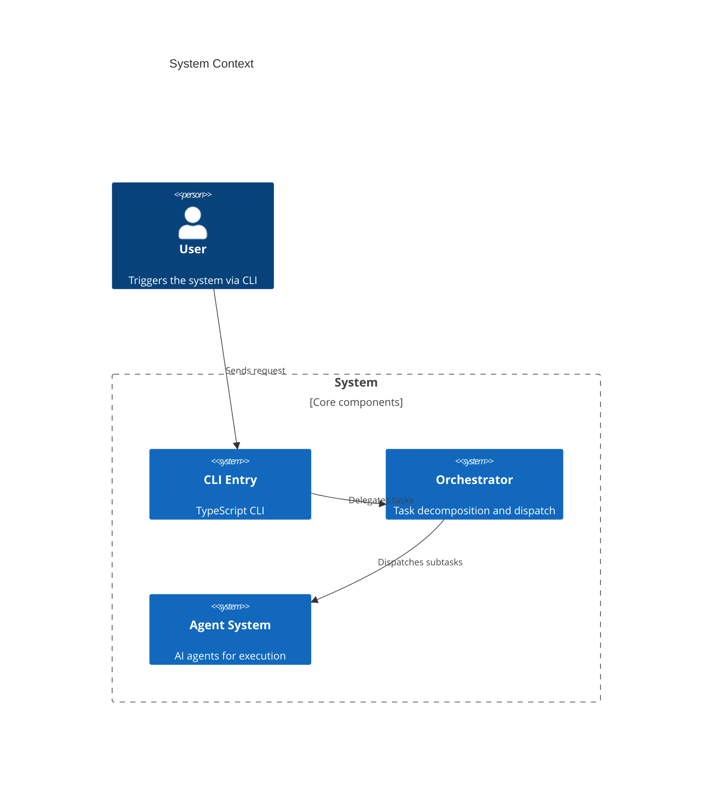

Context files are structured markdown documents that give agents persistent knowledge about your project's architecture and database schemas. They live in well-known directories and are automatically read and updated by agents during their work.

---

## Directory Structure

Context files live in two top-level directories in your project root:

```text
your-project/
├── architecture/          # System design documentation
│   ├── overview.mmd
│   ├── orchestration.mmd
│   ├── pipeline.mmd
│   ├── state-guardrails.mmd
│   └── IMPLEMENTATION-GUIDE.md
├── database_metadata/     # Schema and migration documentation
│   ├── schema.md
│   └── migrations/
├── src/
└── package.json
```

---

## The `architecture/` Directory

This directory contains system design documentation, component interaction diagrams, and implementation guides. Files are typically Mermaid diagrams (`.mmd`) or markdown documents.

### Purpose

- Document the overall system architecture
- Describe how components interact
- Provide implementation guidance for new features
- Record design decisions and trade-offs

### File conventions

- Use `.mmd` for Mermaid diagrams (C4 context, sequence, flowcharts)
- Use `.md` for narrative documentation and guides
- Keep files focused on a single concern (e.g., `orchestration.mmd` for orchestration flow)

### Example: `architecture/overview.mmd`



---

## The `database_metadata/` Directory

This directory contains schema documentation, migration notes, and database-related reference material.

### Purpose

- Document database table structures and relationships
- Record migration history and rationale
- Provide context for agents writing database queries or migrations
- Explain schema constraints and indexes

### File conventions

- Use markdown for schema documentation
- One file per logical domain or table group
- Include column types, constraints, and relationships

---

## How Agents Use Context Files

### In plan mode

When the `plan` agent analyzes code, it reads context files to understand existing architecture before suggesting changes. The plan agent can read from these directories but has restricted write permissions.

### In build mode

The `dynamic_persona` agent has explicit write permissions for context files:

```typescript
// In src/agent/agent.ts
edit: {
  "*": "deny",
  "architecture/**/*.md": "allow",
  "database_metadata/**/*.md": "allow",
}
```

This means the dynamic_persona agent can create and update architecture and database documentation as part of its work, while other agents cannot modify these files by default.

### Automatic updates via orchestrator

The orchestrator injects a directive into each agent's context reminding it to keep documentation current:

```xml
<orchestrator-directive>
Task: Add user authentication
Scope: src/auth/auth.ts
Before completing: update /architecture/ and /database_metadata/ if this task changed architecture or schemas.
</orchestrator-directive>
```

This ensures documentation stays in sync with code changes.

---

## Instruction Files

Context files are related to but distinct from **instruction files** (`AGENTS.md`, `CLAUDE.md`, `CONTEXT.md`). Instruction files provide behavioral guidelines to agents, while context files document project structure.

AgentHorsy resolves instruction files by walking upward from the file being read:

```typescript
// In src/session/instruction.ts
const instructionFiles = [
  "AGENTS.md",
  "CLAUDE.md",
  "CONTEXT.md", // deprecated
]
```

Each instruction file found along the path is attached to the agent's context once per message, preventing duplication.

---

## Creating Context Files

### For new projects

Start with minimal context files that describe your project's high-level architecture:

```bash
mkdir -p architecture database_metadata

cat > architecture/overview.mmd << 'EOF'
C4Context
    title Project Overview

    Person(user, "User")
    System(system, "My App", "Main application")

    Rel(user, system, "Uses")
EOF
```

### For existing projects

Add context files incrementally as agents make changes. The `dynamic_persona` agent will create and update these files automatically when it modifies architecture or schemas.

### Updating during tasks

When an agent modifies database schemas or introduces new architectural components, it should:

1. Update or create relevant files in `architecture/`
2. Update or create migration documentation in `database_metadata/`
3. Keep existing documentation accurate rather than adding new files

---

## Best Practices

- **Keep files focused**: One file per architectural concern or database domain.
- **Use diagrams**: Mermaid diagrams in `.mmd` files are easier for agents to parse than long text.
- **Version control**: Track context files in git alongside your code.
- **Be specific**: Include table names, column types, and API endpoints rather than vague descriptions.
- **Update incrementally**: Update docs as part of each task rather than doing large batch updates.

---

## See Also

- [Agents](/docs/agents) - Agent types and their permissions
- [Orchestrator](/docs/orchestrator) - How the orchestrator delegates context updates
- [Config](/docs/config) - Instruction file configuration
